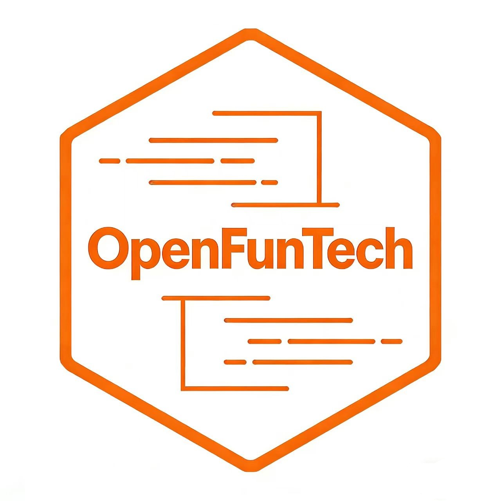
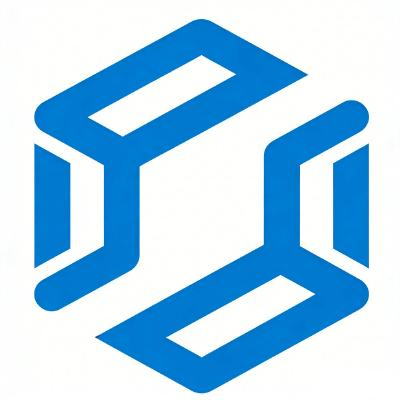
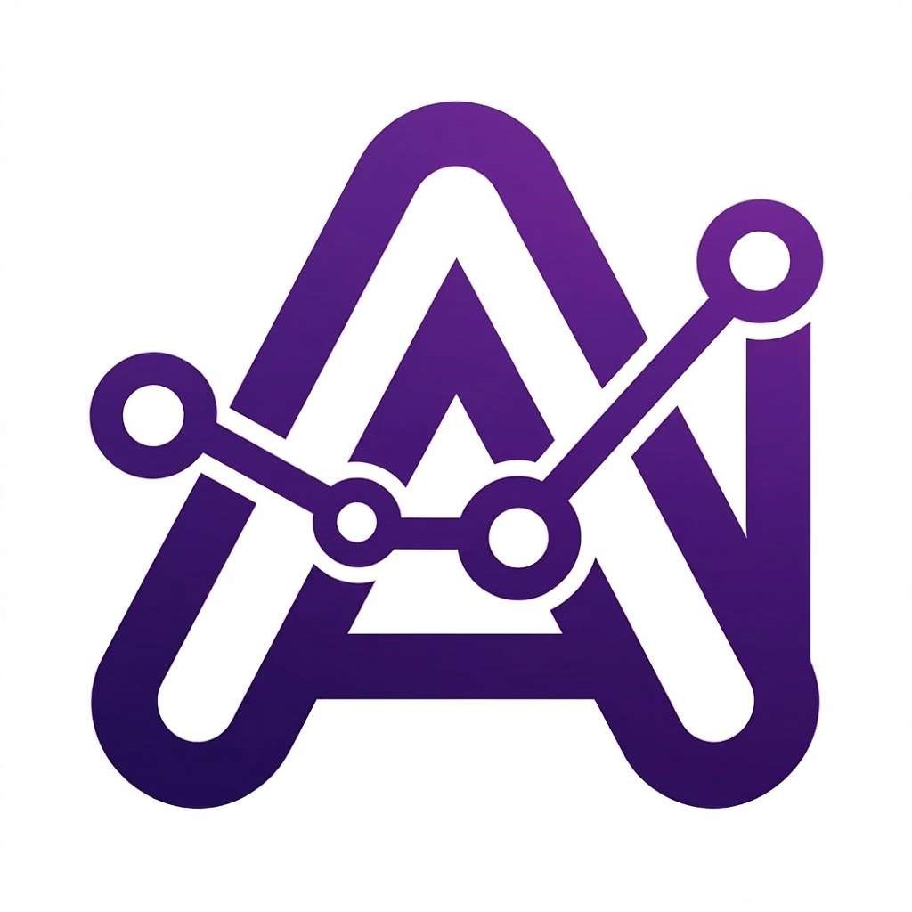

# 🚀 欢迎来到 OpenFunTech 社区

[English](./README.md) | **简体中文**

   
  <b>开放包容 · 兴趣驱动 · 硬核技术</b>

## 🏗️ 社区支柱

| OmniSOC 社区 | LeoLinux 社区 | SagoraAI 社区 |
|-------------|---------------|-------------|
| 

  <b>核心：</b>SoC 设计与异构仿真

 | 

  <b>核心：</b>Linux 内核与虚拟化技术

 | 

  <b>核心：</b>AI 芯片智能工具与 SDK

 |
| 
<a href='https://github.com/OmniSoC'><b>进入社区 →</b></a>
 | 
<a href='https://github.com/Leo-Linux'><b>进入社区 →</b></a>
 | 
<a href='https://github.com/SagoraAI'><b>进入社区 →</b></a>
 |

---

## 📖 关于我们

OpenFunTech 是一个专注芯片、系统软件与 AI 的硬核社区。  
我们通过构建异构仿真平台、系统架构和 AI 工具链，提供从底层逻辑到智能算力的全栈能力。  
社区倡导开放、包容、兴趣驱动，让每位成员都能掌握核心技术并发挥创造力。

---

## 🌐 愿景

**软件定义世界**

> 以 **异构仿真** 为基石，夯实 **系统底座**，驱动 **智能算力**，构建 **高保真数字孪生**，实现从逻辑到感知的全栈闭环。

**全面仿真 · 掌控核心 · 智能进化**
